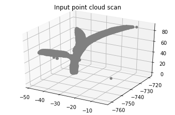
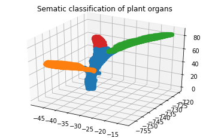
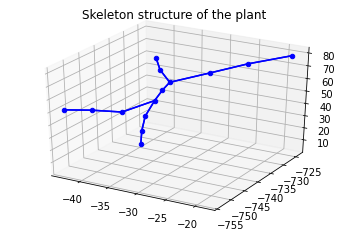
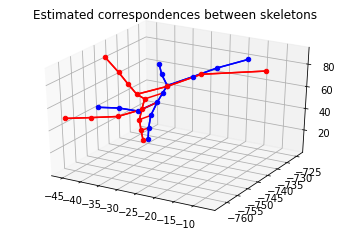

# Spatio-temporal registration point clouds of plants

In this project, we develop techniques for registration of point clouds of plants over space and time.
This is a challenging task due to the growth of the plant and the change in the structure and the 
appearance of the plant over time. Our approach exploits the topology and semantic information 
to compute and find correspondences between the skeletons structures of the plant. We then use these
correspondences to estimate non-rigid registration parameters between the plant scans. This technique
forms the basis for developing automated phenotyping analysis such as monitoring the growth
and the overall performance of a plant. 

## Setup

The project depends on the following external packages:

- numpy
- matplotlib
- scikit-learn
- minisom
- dijkstar
- open3d (for loading and visualizing ply files)
- jupyter-lab/jupyter-notebook (for running the demo notebook)

They can be installed by running:
```bash
pip3 install -r requirements.txt
```

## Usage

We provide a demonstration of the overall registration approach on example scans of maize and tomato plants.
The demo can be run via the the jupyter notebook ``` spatio_temporal_registration.ipynb ``` 

### Demo

We also provide some demo scripts for running individual parts of our approach.

1. Estimating  the skeleton structure of the plant using the sematics

To compute the skeleton structure, you could directly run the following script:

```bash
python3 demo/run_semantic_skeleton_extraction.py
```
This script will compute the skeleton for an example plant scan and visualize it as following:





2. Computing correspondences between plant skeletons

```bash
python3 demo/run_skeleton_matching.py
```

This script will compute the correspondences for two plant scan recorded on consectutive days and visualize it as following:



3. Estimating non-rigid registration paramets between the skeletons

```bash
python3 demo/run_non_rigid_registration.py
```

This script will compute the registration parameters between two skeletons using the correspondences computed earlier and visualize the results. 
Here the blue skeleton is the source skeleton, the red one is the target skeleton and the black skeleton is obtained by applying the estimated
registration params on the source (blue) skeleton.


4. Iterative non-rigid registration procedure

```bash
python3 demo/run_iterative_registraion.py
```

This script will alternate between estimating correspondences and registration parameters in an iterative manner. This results in much better 
registration results as compared to a single step of matching and registration estimation.

5. Deforming the 3d plant point cloud using the registration parameters


```bash
python3 demo/run_pointcloud_deformation.py
```

This script will deform the source scan to the target scan using the registration parameters computed between the corresponding skeletons

## Dataset 

We also provide addition datasets for the spatio-temporal registration of plant point clouds. They can be 
downloaded from:

https://www.ipb.uni-bonn.de/data/4d-plant-registration/

## License

Copyright 2020, Nived Chebrolu, Federico Magistri, Thomas Läbe, Cyrill Stachniss, University of Bonn. This project is a free software made available under the MIT License. For details see the LICENSE file.

## Acknowledgements

This work has been partly funded by the Deutsche Forschungsgemeinschaft (DFG, German Research Foundation) under Germany's Excellence Strategy, EXC-2070 - 390732324 - PhenoRob.